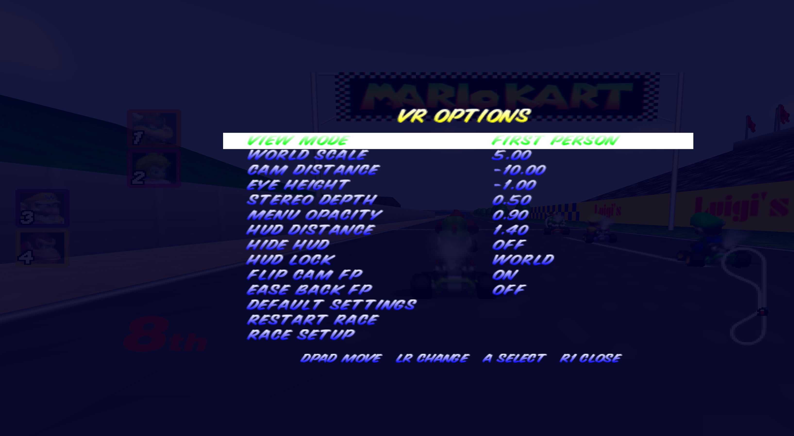
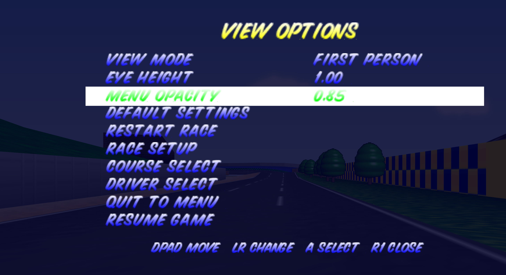
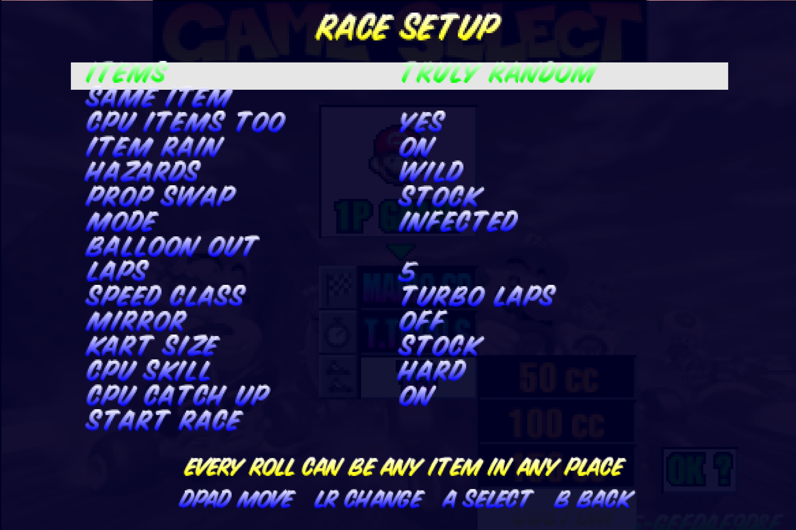

# Mario Kart 64 VR

Play Mario Kart 64 in VR. Built on [SpaghettiKart](https://github.com/HarbourMasters/SpaghettiKart), the Mario Kart 64 PC port. Put on a headset and you're sitting in the kart in stereo 3D with full head tracking. No headset? The same game runs flat on your monitor. Bring your own ROM — no game files are included.

> ⚠️ **Beta — expect bugs.** This is early and still changing. Things may break and not everything is polished yet. Bug reports are welcome.

## How to play (no building needed)

All you need is Windows and your own Mario Kart 64 ROM:

1. Download **`MarioKart64-VR-win64.zip`** from the [latest release](https://github.com/RaYRoD-TV/MarioKart64-VR/releases/latest) and unzip it anywhere.
2. Start your VR runtime — Virtual Desktop, SteamVR, Quest Link, or Air Link. (Skip this to just play flat on your monitor.)
3. Run **`Spaghettify.exe`**. The first time only, it asks for your Mario Kart 64 ROM. Pick it once and you're set.

**About the ROM:** it must be the US version in `.z64` format (SHA-1 `579C48E211AE952530FFC8738709F078D5DD215E`). Got an `.n64` dump? Convert it at <https://hack64.net/tools/swapper.php>.

The game finds your headset on its own and falls back to flat if there isn't one. Force it with `Spaghettify.exe --vr` or `--novr`.

## Controls

Drive with VR motion controllers, a gamepad, or the keyboard. Your head always controls the view.

**VR motion controllers** (Quest Touch, Index, Reverb G2, WMR, Vive — a gamepad still works alongside them):

| Control | What it does |
| --- | --- |
| Left stick | Steer / move through menus |
| A | Gas (and Select in menus) |
| B | Brake & reverse (and Back in menus) |
| Left trigger or X | Use your item |
| Right trigger or grip | Hop & drift — and, when paused, opens the VR menu |
| Menu button (left) | Pause |
| Hold Y | Look behind |
| Right stick | C buttons; push up to change camera distance |
| Right stick click | Switch view: Third Person, First Person, Theater, Diorama |

Your controllers rumble when you take a hit.

**Gamepad:**

| Input | What it does |
| --- | --- |
| Pause, then R1 | Open / close the in-game menu |
| D-Pad or stick | Move through menus; left & right change a setting |
| A | Select |
| D-Pad Up (while racing) | Switch view: Third Person, First Person, Theater, Diorama |
| Hold D-Pad Down | Look behind |
| Z (main menu) | Quit the game (asks first) |

## The in-game menu

Pause the race, then pull the **right trigger** (or press **R1** on a gamepad) to open the menu. This is where you tune everything live — and in VR it floats right in front of you.

In VR it's **VR OPTIONS**:

- **View Mode** — Third Person, First Person, Theater, or Diorama.
- **World Scale** — how big the world feels around you.
- **Cam Distance / Eye Height** — move the camera back/forward and up/down.
- **Stereo Depth** — strength of the 3D pop.
- **Menu Opacity / HUD Distance** — how see-through the menu is, and how far away the HUD floats.
- **Hide HUD** — hide everything except the item box.
- **HUD Lock** — *World* keeps the HUD parked in the room (the default), *Head* makes it follow your face.
- **Flip Cam FP / Ease Back FP** — first-person camera tweaks.
- **Default Settings / Restart Race / Race Setup** — reset everything, restart, or jump to the custom race screen.

Playing flat on your monitor? The same menu becomes **VIEW OPTIONS** with the flat-screen settings:

(Prefer desktop sliders? Press **Esc** for the settings menu — the full set is under Enhancements → VR.)

## Custom races

On the speed-class list (50 / 100 / 150 / Extra) there's one extra option at the bottom: **CUSTOM**. Pick it to open the race setup screen. The normal classes stay 100% stock — custom only changes things when you choose it. Everything here stacks, and the line at the bottom explains whatever you're hovering.

- **Items** — stock, truly random, all one item (you pick which), frantic power items, triples, or inverted (the leader gets the strong stuff). Or turn item boxes off.
- **CPU items too** — whether the CPUs use the same item mode.
- **Item rain** — item boxes fall from the sky ahead of the pack.
- **Hazards** — waves of trouble along the track: bananas, shells, piranha plants, the odd rolling egg, boulders, a rare Lakitu, and trick boxes. Off, level-themed, or wild.
- **Prop swap** — swaps roadside props for surprises.
- **Mode** — the big one. Pick how you win:
  - **Normal** — a regular race.
  - **Knockout** — last one across the line each lap gets shrunk.
  - **Balloons** — everyone gets three; hits pop them (see *Balloon out*).
  - **Tag** — one kart is "it" and rides giant; bump someone to pass it on. Whoever spends the **most** time as "it" **loses**, and it's announced and shown at the finish. CPUs that are "it" will actively chase you down.
  - **Treasure hunt** — first to the giant prize box wins instantly. It flashes on the minimap. (Laps go unlimited — it runs until someone grabs it.)
  - **Infected** — one carrier spreads it by touch. Carriers glow green and keep their items. Survivors win by finishing; the infection wins by getting everyone.
- **Balloon out** (Balloons mode) — what losing your last balloon does: shrink, get eliminated, or just slow down.
- **Laps** — 1 to 5, or no limit (shown as ∞).
- **Speed class** — stock, 200, 300, 500cc, or Turbo Laps (+100cc every lap).
- **Mirror** — flip the track.
- **Kart size** — tiny, giant, or a random size per kart.
- **CPU skill / CPU catch-up** — tougher CPUs; turn catch-up off so a real lead sticks.
- **Start race** — on to character select.

**Track roulette:** press **Z** on the course select to spin a random track. On a Grand Prix cup it shuffles the cup's order instead.

## VS mode (single player)

The one-player menu has a **VS** row under Time Trials. Pick your driver, pick a rival, pick a course — then race them one-on-one, side by side, through the rest of that cup.

## HD textures (optional)

Want it in HD? Texture packs load as mods, no rebuild needed. The recommended one is [MK64 Reloaded](https://github.com/GhostlyDark/MK64-Reloaded) by GhostlyDark. Grab the latest `.o2r` from its [releases](https://github.com/GhostlyDark/MK64-Reloaded/releases/latest), make a `mods` folder next to `Spaghettify.exe`, and drop it in.

## Building from source

Only needed if you want to change the code — players should just grab the release above.

You need Windows, Visual Studio 2026, and CMake. The build pulls everything else (including OpenXR) automatically.

1. Clone this repo.
2. Run `build_vr.bat`. The first build is slow because it builds the dependencies once; full output goes to `build_vr.log`. (On an older Visual Studio? Open the file and set `GEN` to your version, e.g. `Visual Studio 17 2022`.)
3. Run `play_vr.bat`, or the exe at `build/x64/Release/Spaghettify.exe`. The same first-launch ROM prompt applies.

After editing code, `rebuild_vr.bat` does a quick incremental build. VR layer notes are in `VR_README.md`.

## Planned

- Online netplay (race others over the internet) is planned, not done yet.

## Credits

Mario Kart 64 PC port: [SpaghettiKart](https://github.com/HarbourMasters/SpaghettiKart) by HarbourMasters. Engine: [libultraship](https://github.com/Kenix3/libultraship). This fork adds the OpenXR VR layer and the custom race modes.
